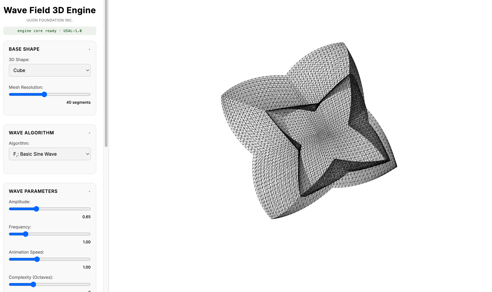

# Wave Field 3D Engine

**UUON Foundation Inc. — Phillip Aguilar Ruiz III**



Live: [https://uuon-foundation.github.io/uuon-wave-field-3d-engine/](https://uuon-foundation.github.io/uuon-wave-field-3d-engine/)

---

## What It Is

A parametric wave-deformation engine that applies 24 physically-grounded wave algorithms to 3D geometry, producing animated mesh assets exportable as GLB with morph-target animation or OBJ static frames.

**Domain:** Parametric surface field deformation — wave mathematics applied to 3D topology.

**Output:** Animated GLB (GLTF 2.0 morph targets), static OBJ, JSON metadata sidecar.

---

## Repository Structure

```
uuon-wave-field-3d-engine/
├── index.html              ← PUBLIC — renderer shell, UI, Three.js scene
│                             No algorithm logic. Calls WFE.* API.
├── core/
│   └── engine.js           ← PROPRIETARY — not in this repo
│                             The licensed engine core. See below.
├── docs/
│   ├── FPERC-diagram.svg
│   └── ACADEMIC-RECORD.md
├── api/
│   └── README.md           ← Planned API server spec
├── LICENSE                 ← USAL-1.0
├── NOTICE                  ← Provenance, deps, architecture split
├── .env.example
├── .gitignore
└── .github/workflows/
    └── gitleaks.yml
```

---

## Public vs Proprietary Split

**`index.html` is public.** It contains the Three.js renderer, the UI panel, and export wrappers. It contains no algorithm logic, no surface coordinate math, no GLB encoding. Every computation call is delegated to `window.WFE.*`.

**`core/engine.js` is proprietary.** It is not committed to this repository. It contains:

| Component | Description |
|-----------|-------------|
| `WFE_surfCoord()` | Unified surface coordinate abstraction — maps sphere, cube, and pyramid to a single scalar `s` that all 24 algorithms consume identically |
| `WFE_ALG` | 24-algorithm catalog with shared `fn(x,y,z,t,p,s)` interface |
| `WFE_bake()` | Deterministic frame sampler — produces Float32Array per frame |
| `WFE_buildGLB()` | Hand-built GLTF 2.0 morph-target GLB encoder (no GLTFExporter dependency) |

To run the engine locally, place `core/engine.js` in the `core/` directory. Licensed users receive this file directly.

---

## What the Engine Exposes (WFE API)

```javascript
// Algorithm catalog — 24 entries, each with name, desc, formula, fn
WFE.algorithms['sine']       // { name, desc, formula, fn(x,y,z,t,p,s) }
WFE.algorithms['gerstner']
WFE.algorithms['fbm']
// ... 24 total

// Surface coordinate abstraction
WFE.surfCoord(shape, x, y, z)  // → scalar s

// Deterministic frame sampler
WFE.bake(origPositions, shape, algKey, params, frameCount, duration)
// → Float32Array[] — one absolute position array per frame

// GLTF 2.0 GLB encoder
WFE.buildGLB(origPositions, indexArray, bakedFrames, meta)
// → ArrayBuffer — valid binary GLB with morph-target animation
```

---

## F=(P,E,R,C) — Compression Formulation

| Symbol | This Engine |
|--------|-------------|
| **P** | `{ shape, algorithm, amplitude, frequency, speed, octaves }` — 6 values, ~48 bytes |
| **E** | `WFE.algorithms[key].fn(x,y,z,t,p,s)` — surface deformation applied per-vertex |
| **R** | WebGL mesh, animated GLB, static OBJ |
| **C** | P=48 bytes → R≈180KB–1.4MB → C≈3,750:1 to 29,000:1 |

---

## Biological Analog — Cephalopod Mantle

Structural (not visual) homology: the engine deforms a fixed mesh topology outward along vertex normals using frequency-layered parametric fields — structurally identical to chromatophore-driven wave propagation across a cephalopod mantle.

Both systems: fixed substrate topology, radial normal-direction deformation, parametric frequency-layered field. The mantle is the renderer; the chromatophore field is the encoding. The mesh is the renderer; the algorithm catalog is the encoding.

---

## Algorithm Catalog (24 Functions)

| Class | IDs | Examples |
|-------|-----|---------|
| Basic | F₁, F₂, F₁₀, F₁₁, F₁₂ | Sine, Cosine, Composite, Modulated, Harmonic |
| Damped | F₁₈, F₂₁ | Exponential Damped, Soliton |
| Physical | G₁, G₂, G₃, C₁, C₄ | Deep Water, Shallow, Gerstner, Capillary, Faraday |
| Ripple | R₁, R₂, I₃, I₂ | Circular Ripple, Bessel, Standing, Beat |
| Seismic | S₃, S₄ | Rayleigh, Love |
| Noise | N₁, N₃, N₄, N₅, N₁₀ | Hash layers, fBm, Ridged, Turbulence, Curl |
| Spectral | FFT₁, FFT₃ | FFT Ocean, Phillips Spectrum |

Note: N-class algorithms use sin-hash approximation, not gradient Perlin noise. Documented in NOTICE.

---

## GLB Export

The GLB encoder is hand-built to the GLTF 2.0 spec. Three.js GLTFExporter r128 fails silently on morph-target animations (produces a 15-byte corrupt file). The WFE encoder writes DELTA position morph targets (required by spec), weight-track animations, and valid chunk padding — producing files that open correctly in Blender, Three.js, Babylon.js, and any GLTF-compliant viewer.

---

## Known Limitations

- Sin-hash noise is not true gradient Perlin — lacks gradient continuity
- Normal-direction displacement breaks on non-convex geometry
- No P-vector save/load from UI (graph serializer not yet built)
- No API server — browser-only
- No persistence layer

**Next session:** Extract `WFE_ALG` catalog into a Node.js module (`api/lib/algorithms.js`). That's the step that makes `P → E → R` callable as an HTTP service.

---

## Usage

```bash
# Requires core/engine.js (licensed separately)
# Place it at core/engine.js, then:
open index.html
# or
npx serve .
```

---

## Commercial Licensing

`core/engine.js` is available under commercial license.
Contact: phi1@uuonfoundation.com

The public repository (this repo) contains the renderer shell under USAL-1.0.
The engine core ships separately to licensed parties.

---

## License

USAL-1.0 — See `LICENSE`
Origin: Phillip Aguilar Ruiz III / UUON Foundation Inc.
AI training use prohibited. Attribution required on all derivatives.
